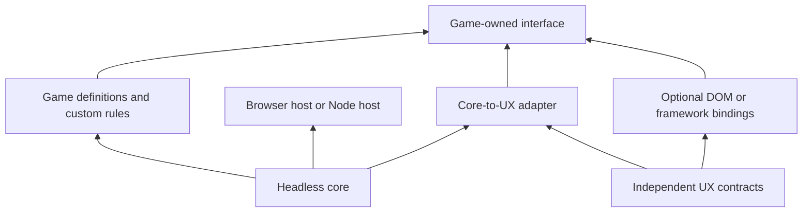

# Proposed library design

Status: proposal. API examples are illustrative, not implemented exports.

The [resolved design contracts](contracts.md) define defaults, edge cases, and acceptance fixtures for the eight review gaps. This document is the architectural overview; those contracts govern detailed behavior.

The [interface decisions](interfaces.md) make the numeric, rate, snapshot, failure, and save boundaries concrete. They also record which third-party review suggestions were accepted or qualified.

Release completion is governed by the [definition of done](definition-of-done.md): pinned TMT capability parity, defined AD/Kittens reference-game parity, Paperclips coverage, and three complete original games with independent correctness evidence. Optional tree/grid/effect views and selling/respec/bulk-challenge/huge-buyable support are required by that target even where absent from initial examples.

## Product boundary

Make building an incremental game's rules pleasant and predictable. Make those rules easy to present through a separate UX library. A developer should be able to use just the simulation, just the UX contracts with an existing engine, or both together.

Working choices: TypeScript, ESM, ordinary JavaScript compatibility, browser and Node execution. No UI framework, DOM access, timers, storage globals, or import-time side effects in the simulation core. Multiple game instances must be independent.

## Packages

Start with two public packages and explicit subpath exports, rather than many tiny packages:

| Entry point | Responsibility |
| --- | --- |
| `@e308/core` | State, actions, advancement, domain events, content-module and mechanic-extension contracts |
| `@e308/core/economy` | Resources, processes, purchases, cost curves, modifiers |
| `@e308/core/progression` | Unlocks, projects, milestones, reset scopes, challenges |
| `@e308/core/markets` | Quotes, trades, finite inventory, fees, and pluggable price models |
| `@e308/core/offline` | Catch-up planning, time accounting, recovery records |
| `@e308/core/testing` | Headless scenarios, bot-player policies, traces, pacing reports |
| `@e308/core/balance` | Curve helpers, tabulation, parameter sweeps, and sensitivity reports |
| `@e308/core/browser` | Clock/lifecycle host, storage adapter, tab ownership |
| `@e308/core/numbers/*` | Explicit optional numeric adapters |
| `@e308/ux` | Framework-independent view models, explanations, formatting contracts |
| `@e308/ux/dom` | Optional unstyled accessible controls and interaction bindings |

The intended product has four explicit parts: a deterministic simulation core; a vocabulary of composable mechanics; a headless harness with bot players and pacing reports; and an optional, replaceable renderer built on the UX library. These are planned capabilities, not existing implementations.

Framework-specific adapters can follow demonstrated demand. A React hook or Vue composable must be a small adapter over the same subscription contract. Theme CSS and example layouts are explicit imports, never global styles injected by core or UX imports. The library is named **e308**. npm packages use the user-owned `@e308` organization; the planned GitHub organization is `e308js`. The initial package split remains `@e308/core` and `@e308/ux`, with testing provided through `@e308/core/testing`. GitHub organization creation and package publication remain future work.

Dependency direction:



Arrows mean “used by.” The UX package takes a narrow read/dispatch interface. It must not require the core's private state representation, force a root component, or dictate routing, tabs, cards, trees, fonts, or screen arrangement.

## Authoring model

Provide named, typed builders for common rules. Store game definitions separately from serializable state. Definition objects may include code; saves contain data only. A stable ID connects them. Avoid a string expression language, giant configuration schema, and a mandatory entity-component-system architecture.

Prefer typed handles over repeated strings. Handle definitions are immutable and contain no player quantity; state is owned by a game instance. Unknown references, duplicate IDs, invalid starting values, and unsupported numeric operations fail at game definition validation.

An illustrative small economy:

```ts
import { createGameKit } from '@e308/core';
import { nativeNumbers } from '@e308/core/numbers/native';

const kit = createGameKit({ numbers: nativeNumbers });
const run = kit.scope('run');
const wire = kit.resource('wire', { scope: run, initial: kit.q('100') });
const clips = kit.resource('clips', { scope: run, initial: kit.q('0') });
const machines = kit.resource('machines', {
  scope: run, initial: kit.q('1'), discrete: true,
});

const makeClips = kit.flow('make-clips', {
  scope: run,
  priority: 0,
  rate: kit.rates.proportional(machines, kit.q('1')),
  consumes: [[wire, 1]],
  produces: [[clips, 1]],
  onInputShortage: 'throttle',
});

const buyMachine = kit.purchase('buy-machine', {
  scope: run,
  costs: [[clips, kit.geometric({ base: kit.q('10'), ratio: kit.q('1.15') })]],
  grants: [[machines, 1]],
});

const definition = kit.defineGame({
  id: 'wireworks',
  resources: [wire, clips, machines],
  flows: [makeClips],
  actions: [buyMachine],
  simulation: { mode: 'fixed-step', stepMs: 50 },
});

const game = definition.create();
game.advance({ durationMs: 1_000 });
const quote = game.inspect(buyMachine, { count: 'max' });
const result = game.dispatch(buyMachine, { count: 'max' });
```

The first version should make this straightforward without requiring worker setup or a renderer. Cost scaling uses a separate purchase count, not the current machine quantity: machines could later be generated, sold, or reset. The native-number example is intentionally small; extreme quantities require an explicit supported adapter.

Custom functions remain ordinary TypeScript. A custom rule may report its next boundary and a validated bulk advancement routine. Otherwise it runs at the game's canonical simulation step. The engine must never infer mathematical exactness from an arbitrary callback.

## State and mutation

Use one owner for state mutations. Commands, simulation, reset operations, and migrations commit through controlled transactions. Read-only snapshots and selectors are the external interface; unrestricted `player.foo++` from the renderer undermines reproducibility and cache invalidation.

Use transaction-owned mutable working state with copy-on-write immutable committed records: a new snapshot root per revision, copied changed records, and shared unchanged records. Published descendants and numeric values must never mutate afterward; freezing only the root is insufficient. Selectors observe committed snapshots with explicit equality checks. Derived rates and caches are recomputed rather than blindly saved. See [snapshot contract](interfaces.md#snapshots-and-selectors).

Saved data includes resource amounts, purchase counts, acquired upgrades, state flags, task queues, timers/remainders, reset currencies, selected automation policies, random state, and simulation position. Definitions contain formulas and handlers. Presentation preferences live separately from economic state unless they actually affect game rules.

Track balance, lifetime production, run production, and maximum balance separately. Refunds and transfers are typed events; they must not accidentally count as fresh production for an achievement or prestige formula.

## Domain primitives

| Primitive | Required behavior |
| --- | --- |
| Resource | Quantity, optional capacity, units, overflow rule, counters |
| Action | Preconditions, cost, atomic effect, structured failure reason |
| Purchase | Purchase count, cost curve, buy-one/bulk/max, milestones |
| Process | Inputs, outputs, rate, constraints, production explanation |
| Task | Duration, completion effect, queue, cancellation/refund policy |
| Modifier | Named source, target, operation, priority/stacking group |
| Unlock | Hidden/revealed/available distinctions and persistence policy |
| Project | One-time action with prerequisite and transition effects |
| Reset | Reward computed from pre-reset state; explicit cleared/retained scopes |
| Challenge | Enter/exit rules, temporary rule overrides, goals, rewards |
| Automation | Scheduled use of ordinary actions with priorities and conditions |
| Allocation | Assign a finite budget of workers, power, trust, or points among competing uses |
| Market | Quotes, inventory, price policy, fees, order execution, and sale/purchase events |
| Calendar | Explicit phase boundaries affecting rates and events |

These can ship in stages. A resource need not have a renderer label in core; the UX catalog supplies localized names, units, and description tokens.

### Economy constraints

Consumption and production form one transaction: no output from unpaid inputs and no partially deducted multi-resource purchase. Competing processes need declared allocation semantics. A practical initial policy is stable priorities evaluated from the start-of-step state; proportional allocation can be added explicitly. Newly produced inputs become available at the documented boundary, not through accidental array order.

Flows default to discard-overflow; an explicitly blocking output limits the whole process. Capacity decreases default to retaining existing over-cap stock until spent. Recursive overflow redirection is deferred. The [production contract](contracts.md#1-production-semantics) defines reservation order and the separate behavior of flows, recipes, timed tasks, and generator chains.

Fractional production of discrete items accumulates in saved remainders. Producing 0.2 items five times should be able to yield one item; flooring each invocation independently loses production and makes batching alter the game.

### Costs and bulk buying

For base cost `b`, growth factor `r`, purchases already made `k`, and requested quantity `n`:

`total = b × r^k × (r^n − 1) / (r − 1)` for `r ≠ 1`; `total = b × n` when `r = 1`.

This is the geometric series for a fixed scaling segment. Milestones, discounts, and price breakpoints require segmented quotes. A max-buy inversion is only a candidate: recheck the summed price in the selected numeric backend and correct near rounding boundaries. For custom monotone curves, a bounded search can use an explicit cumulative-cost function. Non-monotone or state-mutating purchases need a different declared policy.

Resource capacity can make a price unreachable even with positive income. Quotes should expose that reason instead of inventing an ETA.

### Modifiers and resets

Define modifier stages explicitly, for example base replacement, additive terms, multiplicative groups, powers, soft caps, and hard caps. Developers can choose a different order; ordering is data, not object iteration. Return a breakdown of contributions from the same evaluation that produces the rate.

A reset previews rewards, things lost, things retained, and newly unlocked content. Execution reevaluates eligibility and reward atomically, rejecting a stale confirmed preview. Reset scopes are named game domains, not implied UI rows. The [progression contract](contracts.md#2-prestige-resets-and-challenges) defines queued-command invalidation, task escrow, scheduler retention, challenge combinations, and reward idempotency. Guard repeated zero-time reset/achievement cascades with a diagnostic bound.

Named prestige layers compose a reward rule, reset scopes, unlock conditions, and retained state. Layers may depend on one another without requiring a visible tree or inheriting reset behavior from screen position. Challenges compose temporary rule overrides and entry/exit resets with those same primitives.

### Allocation tradeoffs

An allocation has a finite budget, named destinations, integer or continuous units, minimum/maximum bounds, and an explicit reassignment policy. A worker pool can divide workers between food and wood; a probe can divide trust between speed, replication, and defense. A power budget can constrain processes without being a stored currency.

Allocate or rebalance atomically. Validate that total assignment does not exceed the budget, and explain destination limits or unassigned capacity. If the budget shrinks, choose an explicit response: reject the cause, remove assignments by priority, or proportionally reduce them where fractional units are allowed. Offline simulation preserves the chosen allocation unless a scheduled automation rule changes it. It must not optimize the player's choices implicitly.

The UX receives the available budget, assignments, marginal effects, and constraint reasons. The developer decides whether to render sliders, numeric inputs, a table, or a custom diagram.

### Markets

A market is a composable trading mechanism, not an automatic conversion of all production into money. Provide a quote/execution contract and small price-policy implementations:

- Fixed prices with stock and optional fees.
- Geometric or piecewise prices that change with purchased volume.
- Game-authored demand curves, inventory-dependent prices, and scheduled fluctuations.

Quotes include side, quantity, total cost/proceeds, inventory limits, and state revision. Execution rechecks the current state and commits payment and delivery together. Buying a batch sums or integrates its declared marginal-price model; it cannot simply multiply the first unit's price when the trade changes prices. Rounding and fee rules belong to the market definition.

Paperclips-style sales can be a process connecting inventory to a market, with price as a player-controlled policy and demand limiting sales. A stochastic market uses the simulation's seeded event schedule. Price changes are time boundaries for offline advancement. Start with these mechanisms; an order book, multiplayer exchange, or econometric market simulator is not required.

## Simulation contracts

Expose `advance(duration)` independently of the browser loop. For the baseline, use a fixed quantum with a saved remainder. UI rendering frequency and worker batch size do not change the tick sequence. Actions are applied at defined boundaries, with stable sequence numbers for ties.

Recommended canonical step order:

1. Apply commands scheduled at this boundary.
2. Evaluate current modifiers and rates.
3. Allocate inputs and advance processes across the step.
4. Apply completions and calendar events at the endpoint.
5. Resolve unlocks and milestones in a bounded, stable order.
6. Run due automation actions; their effects apply to subsequent production.
7. Commit state and coalesced events.

Make this order part of the simulation version. Different games can eventually define alternate schedules, but arbitrary extension order should not silently become game balance.

An optimized integrator must preserve the declared numerical result to be classified as canonical. Algebraic equivalence alone does not guarantee identical rounding. A different evaluation with measured differences is an explicitly selected approximate mode, even when mathematically equivalent over real numbers. Continuous integration is also a different model from the discrete recurrence. See [offline.md](offline.md) and the [determinism boundary](contracts.md#8-determinism-and-performance-boundaries).

### Exactness has prerequisites

Use three capability levels:

- **Canonical stepped:** works for arbitrary compliant rules, with potentially expensive catch-up.
- **Validated bulk/event advancement:** fast-forward rules with stated preconditions, respecting intervening events.
- **Game-authored approximation/reward:** deliberately different behavior, selected and reported explicitly.

A custom callback reading another resource can invalidate a supposedly constant rate. Start with conservative dependency declarations or invalidate at every canonical boundary; introduce automatic read tracking only if profiling and authoring experience justify it. Dependency cycles are allowed in stepped simulation but cannot be topologically sorted into an exact analytical shortcut.

RNG state is persistent. Choose versioned `xoshiro128**` with named streams and the seed derivation in [interfaces.md](interfaces.md#rng-and-save-representation). Random consumption depends on simulation events, not render calls. Separate streams for independent subsystems reduce accidental coupling. An aggregate random distribution is not pathwise replay of the same draws; it needs an explicitly permitted policy and statistical validation.

## Persistence and hosting

A save envelope needs `gameId`, schema version, simulation/content version, numeric codec ID/version, state revision, state, RNG state, time anchor, simulation remainder, and pending catch-up data. Save state and its time metadata as one coherent record. A checksum detects accidental damage; it does not make a local save authoritative.

Also record the module/version manifest, content digest, and resolved absence entitlement at the saved checkpoint. On a rules update, the default is migrate first, then advance unprocessed time with installed rules while preserving saved entitlement. Pending sessions require an explicit compatible transition. See [update policy](contracts.md#6-updates-during-absence).

Load into a candidate state: parse with size limits, validate, migrate sequentially, restore numeric values, validate again, recompute derived values, then replace the active state. Preserve the original save and a prior valid backup. Reject unknown future versions without overwriting them. Stable IDs and explicit migrations handle renamed/deleted content.

The browser host provides autosaving, lifecycle reconciliation, IndexedDB persistence, export/import, and one-writer coordination. Storage failures surface through typed status events. A simpler storage adapter may be supported, but it must state its transaction and concurrency guarantees. Network sync is optional future work with revision-conflict handling; never merge game saves by summing currencies.

A worker host loads game definitions as code through the build, then receives serialized state and commands. Do not attempt to postMessage arbitrary closures. Cancellation occurs between committed chunks and preserves remaining catch-up. No worker is required for correctness; it is a responsiveness option.

## The separate UX library

Its purpose is to answer player questions consistently:

- What can I do, and why is this action unavailable?
- What will a purchase change?
- What produces and consumes this resource?
- When might I afford this, fill storage, or run out?
- What will a reset remove and preserve?
- What happened while I was away?

Define independent contracts such as `ActionView`, `ResourceView`, `ResetPreview`, `OfflineReport`, and `SaveStatus`. The core adapter maps engine results into those contracts; another engine can implement them too.

An action view includes visibility, eligibility, exact cost quantities, affordability, structured blockers, purchase count options, and preview revision. A resource view includes quantity, capacity, gross/net rates, active constraints, and optional breakdown. Text is built from localization keys and quantities, not trusted HTML strings returned by game rules.

ETA is a tagged result: exact under declared assumptions, estimated with assumptions, blocked by capacity, no positive rate, unknown, or not applicable. For a constant net rate, `(cost − balance) / rate` is useful. A changing economy, pending purchase, or seasonal transition makes that formula a projection, not a promise.

Subscription contract:

```ts
interface GameViewSource<View, Command> {
  getSnapshot(): Readonly<View>; // stable identity until a published change
  subscribe(listener: () => void): () => void;
  dispatch(command: Command): Promise<CommandResult>;
}
```

`CommandResult` is a proposed discriminated result including success/failure and the committed revision. Promise-based dispatch accommodates workers; core's direct API can remain synchronous. Selectors and equality checks prevent every number update from rerendering the whole screen. Previews are advisory: dispatch always checks the current state, particularly after a worker round-trip.

### Optional interaction bindings

Provide unstyled semantic controls: action button, quantity picker, progress display, resource readout, reset confirmation, offline report, and save management. Offer native buttons, keyboard behavior, focus handling, and structured labels. Layout and CSS remain game-owned. Headless models alone cannot guarantee accessibility; bindings and examples demonstrate it.

Keep focus stable as items unlock. Essential costs and reasons must be available on keyboard focus and touch, not only hover. Batch screen-reader announcements for meaningful events; never announce every resource tick. Support reduced motion, contrast-independent status indicators, explicit units, and stable-width number formatting. Avoid revealing undiscovered content through tooltips or hidden labels.

Hold-to-buy is optional and stops on release, blur, cancellation, or loss of affordability; its repeat rate is an input policy. Keyboard shortcuts ignore text-entry fields and are remappable. Confirm destructive resets from their actual preview, with a per-game opt-out policy if desired.

The offline report distinguishes elapsed, credited, simulated, pending, and discarded time. It reports stock changes, important production totals where relevant, capacity loss, purchases/resets, unlocks, and stop reasons. A net resource delta alone can hide that a factory produced thousands of units which automation spent.

### Optional renderer

Ship a real rendering option, not only data contracts. The initial DOM renderer composes the unstyled controls into game-authored view trees, subscribes to the UX models, and dispatches actions through the shared interface. It supplies interaction behavior and an opt-in starter theme; the game supplies structure and content. It must not require a particular application shell or turn a prestige dependency into a mandatory visual tree.

Support three levels of adoption: custom rendering of headless view models, individual supplied controls in an existing interface, or a complete example renderer assembled from those controls. The core and harness run with none of them. A developer can replace the renderer without rewriting the game economy or saves.

## Developer experience

Prioritize readable errors, type inference, working examples, and a short path to a first playable economy. Provide an inspector for rates/modifiers, time advancement, and command traces before building a visual editor. Keep diagnostics optional and bounded so offline processing does not allocate millions of UI events.

Useful tools include a headless time-skip CLI, seeded scenario runner, balance traces, save inspection, migration fixtures, and graph export for dependencies. Measure allocation and main-thread responsiveness as well as total simulation speed.

## Headless harness, bot players, and pacing reports

Make this a first-class deliverable. The harness loads the same definition, save codec, simulation, and action API as the actual game. It can run a recorded command stream or a bot policy from an initial state/seed until a duration, target milestone, deadlock, or work limit. No renderer or browser is required.

A bot is a strategy, not an engine privilege. Give it an observation snapshot and legal-action quotes; it issues the same validated commands a player can issue. Provide deterministic scripted policies first, followed by affordable-first, declared-goal pursuit, allocation heuristics, and configurable reset thresholds. Keep bot randomness on its own seeded stream. Restrict bots to player-visible information by default; developer omniscient runs must be labeled separately.

Do not confuse a testing bot with in-game automation. A bot can represent an active player making choices every few seconds, while in-game automation remains constrained by unlocks and cooldowns. Offline portions of a scenario stop the active-player bot and run only actual enabled game automation. Session schedules model active, idle-open, and absent play under the declared entitlement policy.

Illustrative API:

```ts
const report = await runScenario({
  game: definition,
  seed: 'balance-baseline',
  initial: 'new-game',
  player: scriptedPolicy([
    { goal: 'unlock-workshop' },
    { goal: 'first-prestige', resetAt: 'target-reward' },
  ]),
  schedule: [
    { mode: 'active', durationMs: minutes(10), decisionEveryMs: 1_000 },
    { mode: 'away', durationMs: hours(8) },
    { mode: 'active', durationMs: minutes(10), decisionEveryMs: 1_000 },
  ],
  stopAt: { milestone: 'second-era', maxRealMs: days(2) },
});
```

Export both machine-readable JSON and a readable Markdown/HTML pacing report. Record game/content/simulation versions, seed, bot policy, schedule, numeric backend, and fidelity so results can be reproduced. Report:

- Time to the first producer, automation, research, prestige, and each declared milestone.
- Waiting stretches with no affordable useful action under the chosen policy.
- Manual action counts and peak required decision frequency.
- Resource/capacity bottlenecks, input starvation, overflow, allocation history, and market activity.
- Reset frequency, reward growth, and time to recover the prior run's progress.
- Active versus absent progress, credited/discarded absence, and approximation differences.
- Unreachable goals, rejected actions, and simulation diagnostics.

Useful reports need game-authored targets and strategy choices. “Useful action” and “optimal prestige” cannot be inferred universally from a resource graph. A stalled heuristic is not proof the game is impossible. Compare several policies and seeds, use known scripted paths as controls, and distinguish observed stalls from mechanically proven capacity barriers. Bot traces diagnose pacing; human playtesting still evaluates clarity and enjoyment.

Keep sample frequency independent of simulation frequency. Aggregate counters during long runs and retain significant events rather than every tick. Baseline comparisons can flag milestone-time regressions and new dead ends without treating every balance change as a defect.

## What remains to validate

Production, reset, module, update, renderer, and harness behavior now have specified defaults in [contracts.md](contracts.md). The numeric backend, builder ergonomics, and practical performance still need implementation experiments against those contracts. Specification is not measured validation. Stabilize the public API only after the examples in [implementation-plan.md](implementation-plan.md) exercise all three game families.
